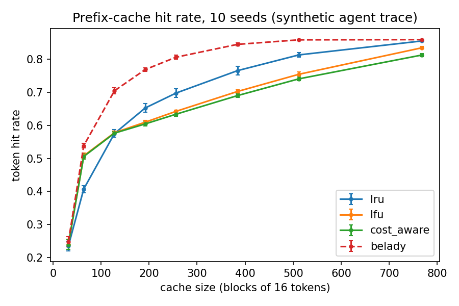

# prefix-cache-lab

**How much of prefix caching's prefill saving survives memory pressure, and which
eviction policy keeps the most of it, for multi-turn agent and RAG workloads?**


Prefix caching lets requests that share a prompt prefix (system prompt, tool
schemas, retrieved documents, earlier turns) reuse the KV cache of that prefix
instead of recomputing it in prefill. This lowers time-to-first-token (TTFT) and
GPU compute. It does **not** reduce the number of tokens in a request.

The KV block pool is finite. When it is full, something must be evicted, and
that choice decides how much of the saving is kept. This repo studies that choice
in a controlled setting: a block-level prefix tree over a paged KV pool,
pluggable eviction policies, synthetic and (later) real workloads, an offline
oracle upper bound, and finally a real model to measure TTFT.

> **Status.** The simulator, policies, oracle and multi-seed evaluation are done
> (milestones M0-M1). Real-model integration, latency measurement, more workloads
> and a new policy are planned (M2-M7). Nothing here is a benchmark against
> SGLang or vLLM yet. See [Limitations](#limitations).

## Results so far

Token hit rate vs. cache size on a synthetic multi-turn agent trace (10 seeds,
error bars are one standard deviation; block size 16 tokens; working set is about
1000 blocks).



| Blocks | LRU | LFU | CostAware (v1) | Belady oracle |
|---:|---:|---:|---:|---:|
| 64  | 0.407 | 0.508 | 0.506 | 0.538 |
| 128 | 0.575 | 0.578 | 0.576 | 0.705 |
| 256 | 0.698 | 0.642 | 0.634 | 0.807 |
| 512 | 0.814 | 0.755 | 0.741 | 0.859 |

What this shows:

1. **No single policy wins.** LFU is ahead when the cache is small (64 blocks);
   LRU is ahead once it holds a quarter of the working set or more. The crossover
   is around 128 blocks.
2. **There is headroom.** The oracle beats the best online policy by up to about
   13 points (128 blocks: 0.705 vs 0.578). A better policy is not ruled out.
3. **The first cost-aware score adds nothing over LFU.** Its cost term
   (`1 + 0.1 * depth`) was a guess. Cost-aware v2 (milestone M5) will use measured
   recompute time instead.

A bug worth knowing about, found through this benchmark: an earlier version did
not pin a request's newly inserted blocks, so frequency-based policies evicted
them mid-insert. LFU and cost-aware looked far worse than LRU (0.28 / 0.09 vs
0.57 at 128 blocks) until this was fixed. The regression test is
`test_insert_does_not_evict_its_own_new_blocks`.

## Architecture

```
                 ┌────────────────────────────────────────────┐
  workloads      │ trace.py: synthetic multi-turn agent trace  │
  (B)            │ (planned: RAG-Zipf, branching, real logs)   │
                 └───────────────────┬────────────────────────┘
                                     │ list of token-id prompts
                                     ▼
 ┌────────────────────────────────────────────────────────────────┐
 │ simulator.py (C): for each request                              │
 │   match_prefix -> lock -> insert uncached blocks -> unlock       │
 │   records hit tokens, prefill tokens, evictions, eviction age    │
 └───────────────┬──────────────────────────────┬─────────────────┘
                 ▼                              ▼
   ┌───────────────────────────┐    ┌──────────────────────────────┐
   │ radix_cache.py (A)        │    │ policies.py / oracle.py      │
   │ block-level prefix tree   │◄───│ LRU, LFU, CostAware, Belady  │
   │ ref-count pinning         │    │ priority(node, now); lowest   │
   │ leaf-only eviction        │    │ priority is evicted first     │
   └─────────────┬─────────────┘    └──────────────────────────────┘
                 ▼
   ┌───────────────────────────┐
   │ block_allocator.py (A)    │   fixed pool of KV blocks
   └───────────────────────────┘

 evaluate.py: sweep policies x cache sizes x seeds -> mean and std
 (D, planned) real-model engine: the same cache holds actual KV tensors
```

Design notes:

- The tree is **block-granular**: each node owns one block of `block_size` tokens
  keyed by those token ids, and a root-to-node path is a cached prefix. Only full
  blocks are cached. This is simpler than SGLang's compressed radix tree and
  closer to vLLM's block hashing. It is not the same data structure.
- Only **unpinned leaves** are evictable, so a cached prefix is never left with a
  hole in the middle. A request pins its matched path and its own new blocks
  while it is being inserted.
- A policy is one method, `priority(node, now)`. The lowest priority is evicted
  first, so a new policy is a small class.

## Quickstart

```bash
git clone https://github.com/cininef/prefix-cache-lab
cd prefix-cache-lab
pip install -e ".[dev]"
pytest                                   # 19 tests
python benchmarks/compare_policies.py    # one trace, several cache sizes
python benchmarks/multi_seed.py          # 10 seeds + oracle, writes the figure
```

Add a policy:

```python
class MyPolicy:
    name = "mine"
    def priority(self, node, now):        # node has last_access, hit_count, depth, created
        return (node.hit_count, node.last_access)
```

## What this project is trying to find out

Most prefix-cache work asks "how do we share a prefix?". This project asks the
next question: **once sharing works, the pool fills up, and what you evict
decides how much of the saving you keep.** Production systems mostly answer with
LRU. LRU is a reasonable default, but the results above already show it is not
best everywhere, and the gap to an oracle is large. The goal is to understand
*why* a policy wins or loses on a given workload, and whether a policy that
uses more of what a serving system knows can close part of the gap.

Three ideas drive the design:

1. **Separate the mechanism from the policy.** The tree, pinning and allocator
   are fixed; a policy is a single `priority(node, now)` function. That keeps
   comparisons fair and makes new policies cheap to try.
2. **Always compare against an upper bound.** A hit rate means little alone. The
   Belady oracle says how much room is left, so "policy A beats B" and "policy A
   is close to optimal" are different, checkable claims.
3. **Do not trust hit rate as a proxy for latency.** A hit on a long, deep prefix
   saves more prefill work than a hit on a short one. So the simulator is
   calibrated against a real model before any TTFT claim is made.

The hypothesis I find most interesting, and could easily be wrong: **agents that
call tools pause.** While a session waits for a tool result its KV blocks sit
idle, yet it will resume soon and will need them. LRU sees "not touched
recently" and evicts them; a policy that models expected resume time might not.
Whether this matters in practice is exactly what the workload experiments are for.

## How it gets built, step by step

**Done: simulator and evaluation (M0-M1).** Pure Python 3.12 with dataclasses, no
heavy dependencies, so it runs anywhere and tests in milliseconds. `pytest` for
19 unit tests, `matplotlib` for figures, GitHub Actions for CI. The block-level
prefix tree, three policies, a Belady oracle, a synthetic agent-trace generator
and a multi-seed sweep are in place.

**Next: put a real model behind the cache (M2).** PyTorch and HuggingFace
`transformers` with a small causal LM (for example Qwen2.5-0.5B), on CPU or
Apple MPS so no CUDA GPU is needed. The cache stores real per-block KV tensors,
and a request prefills only the part of its prompt that is not cached. The
correctness bar is strict: greedy output must match plain `generate()` token for
token. Without this, any speed number would be measuring a bug.

**Then: measure what a cached token is actually worth (M3).** Time prefill with
`time.perf_counter` (plus device synchronization on MPS) across cached-prefix
lengths and total lengths, and fit a small latency model with NumPy. The
simulator can then report estimated TTFT, and cost-aware policies can use
measured recompute cost instead of a guessed formula.

**Then: widen the workloads (M4).** Trace generators built with NumPy (Zipf
popularity via `numpy.random`) and, where usable, public chat or agent datasets
loaded with HuggingFace `datasets`. Workloads to add: RAG with popular documents
placed before the question; tool-calling agent loops with think-time pauses;
branching and multi-agent systems that fork from one shared context;
long-context coding agents; and reasoning models whose long decodes hold blocks
and shrink the pool. The point is to test whether the LRU/LFU crossover seen
today survives outside my own generator.

**Then: try better policies (M5).** Pure Python again: aging and LRU-2 variants,
ARC-style adaptive recency/frequency, cost-aware v2 using the M3 model, and the
pause-aware policy above. Each signal (recency, frequency, depth, cost, expected
resume time) gets an ablation so a win can be attributed.

**Finally: end-to-end TTFT and write-up (M6-M7).** Replay a request stream
against the real model under each policy and report measured TTFT, with negative
results included. Compare behavior against SGLang RadixAttention and vLLM
automatic prefix caching where that is feasible on the hardware available.

The milestone table with completion criteria is in [docs/ROADMAP.md](docs/ROADMAP.md).

## Deliberately out of scope for now

These are real and active directions, but each changes what "evict" means, so
they are follow-ups rather than part of this study: tiered KV storage (moving
evicted blocks to CPU memory or disk instead of dropping them), non-prefix KV
reuse for RAG chunks, prefix-aware request routing across replicas, and
prefill/decode disaggregation.

## Related work

- PagedAttention / vLLM (Kwon et al., 2023): paged KV blocks, automatic prefix caching.
- RadixAttention / SGLang (Zheng et al., 2023): radix-tree prefix reuse with LRU eviction.
- Belady's algorithm (1966): the offline optimal replacement policy, used here as the oracle.
- Later work on KV reuse for RAG, KV tiering and prefix-aware scheduling exists.
  I have deliberately listed only the classic references I am sure of; the rest
  will be added and verified in M7 rather than cited from memory.

## Limitations

- All numbers are from a **simulator on a synthetic trace**. Hit rate is not TTFT
  until M3 and M6.
- The trace generator is my own; real agent traffic may differ (no Zipf
  popularity, no tool-call pauses yet).
- The tree is block-granular, not SGLang's compressed radix tree.
- The oracle is an upper-bound reference. Because eviction is leaf-only, it is a
  strong heuristic bound and not a proven optimum.
- No comparison against vLLM or SGLang yet.

## Repository layout

```
src/prefixlab/   block_allocator, radix_cache, policies, oracle, trace, simulator, evaluate
tests/           19 unit tests
benchmarks/      compare_policies.py, multi_seed.py
docs/            ROADMAP.md, hit_rate_vs_cache.png
```

## License

MIT
