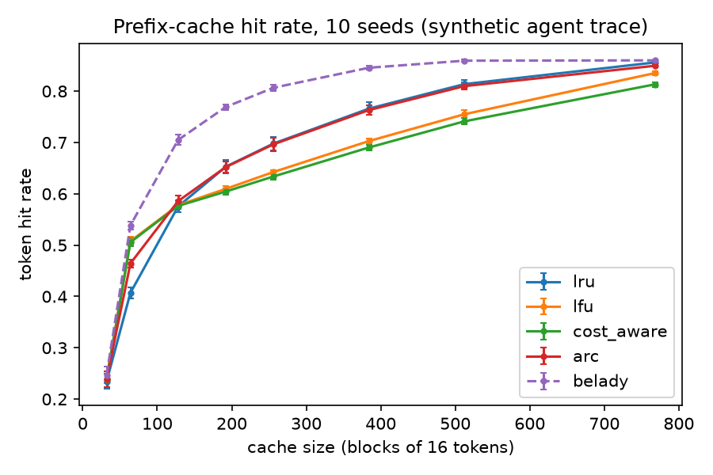
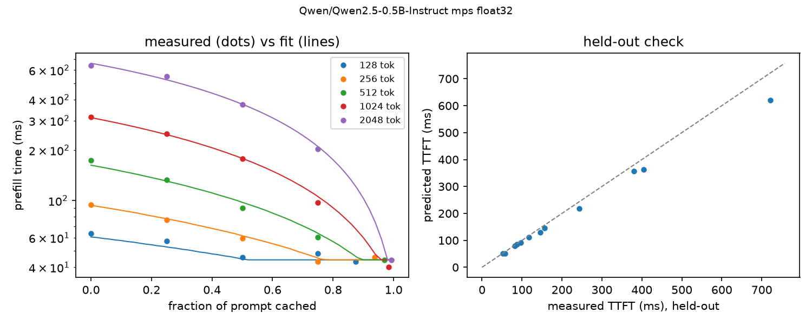
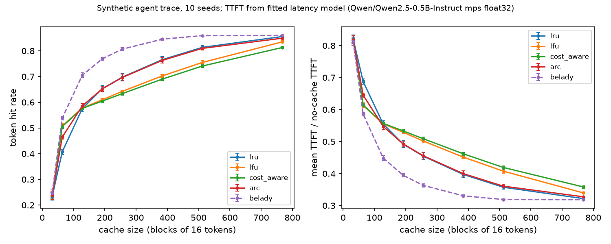
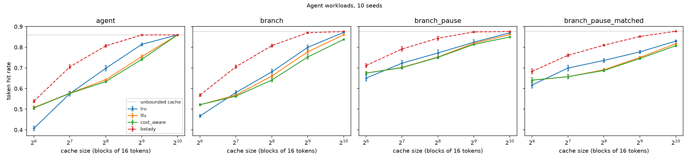

# prefix-evict-lab

[](https://github.com/cininef/prefix-evict-lab/actions/workflows/ci.yml)


**How much of prefix caching's prefill saving survives memory pressure, and which
eviction policy keeps the most of it, for multi-turn agent and RAG workloads?**

Prefix caching lets requests that share a prompt prefix (system prompt, tool
schemas, retrieved documents, earlier turns) reuse the KV cache of that prefix
instead of recomputing it in prefill. This lowers time-to-first-token (TTFT) and
GPU compute. It does not reduce the number of tokens in a request.

The KV block pool is finite. When it is full, something must be evicted, and that
choice decides how much of the saving is kept. This repo isolates that choice: a
block-level prefix tree over a paged KV pool, pluggable eviction policies, an
offline Belady oracle as an upper bound, and multi-seed evaluation on synthetic
agent traces.

## Key findings

Token hit rate vs. cache size on a synthetic multi-turn agent trace (10 seeds,
error bars are one standard deviation; block size 16 tokens; working set is about
1000 blocks).



| Blocks | LRU | LFU | CostAware (v1) | Belady oracle |
|---:|---:|---:|---:|---:|
| 64  | 0.407 | 0.508 | 0.506 | 0.538 |
| 128 | 0.575 | 0.578 | 0.576 | 0.705 |
| 256 | 0.698 | 0.642 | 0.634 | 0.807 |
| 512 | 0.814 | 0.755 | 0.741 | 0.859 |

1. **LRU is not always the best policy.** LFU is ahead when the cache is small
   (64 blocks); LRU is ahead once it holds a quarter of the working set or more.
   The crossover is around 128 blocks. Shared heads (system prompts) reward
   frequency; private tails (the latest turn of a live session) reward recency.
   No single signal serves both.
2. **There is headroom.** The oracle beats the best online policy by up to about
   13 points (128 blocks: 0.705 vs 0.578).
3. **A guessed cost term does not help.** The first cost-aware score
   (`1 + 0.1 * depth`) is indistinguishable from LFU. A useful cost model has to
   come from measured recompute time.

### From hit rate to TTFT (real model)

The same cache now drives a real model (Qwen2.5-0.5B-Instruct, fp32, batch 1):
the KV tensors of every cached block live in a pool indexed by the tree's block
ids, and a request prefills only its uncached suffix.

4. **Prefix reuse is exact.** Greedy output with reused KV matches plain HF
   `generate` token for token (6/6 multi-turn replies, also with a 14-block pool
   that forces eviction; tiny-model parity tests run in CI).
5. **A fitted latency model predicts real TTFT within a few percent.**
   `prefill(C, N) = max(floor, a + b*N + c*N*(C + N/2))` for C cached and N new
   tokens, plus a gather cost for copying the hit out of the pool. On Apple MPS:
   held-out error 7% mean; on a 120-request stream through the real engine, mean
   TTFT is predicted within +3.5% and the engine's cached tokens equal the
   simulator's on every request.



6. **The TTFT benefit is capped well before hit rate saturates.** A short
   forward on MPS costs ~38 ms no matter how few tokens it computes (host-side
   kernel dispatch), so even if every request hit all but its last block, mean
   TTFT on this trace would only fall to ~29% of no-cache. Hit rate 0.81 -> 0.86
   moves TTFT only 0.36 -> 0.32.
7. **Mid-size policy gaps survive as latency.** At 128 blocks the oracle's +13
   point hit rate over LRU is 19% lower TTFT (0.449 vs 0.555 of no-cache); at 256
   blocks LRU beats LFU by 10%. The M1 ranking is unchanged.
8. **Recompute cost is nearly flat in depth at this scale.** Per 16-token block,
   cost(d) ~ 1 + 0.004*d (MPS), so the guessed `1 + 0.1*depth` overweights depth
   about 25x. Eviction value here is mostly reuse probability, not recompute cost.



### Workloads beyond the agent trace (M4)

9. **No fixed policy wins everywhere.** On agent workloads (plain, sub-agent
   forks, tool pauses) LRU is best at 128 blocks and up; on RAG, where document
   popularity is skewed, LFU is best at every size. Measured on 4 agent traces,
   3 synthetic RAG orders and a real retrieval stream (BEIR NFCorpus, BM25 top-5
   for all 3237 queries).
10. **For RAG, document order matters more than the policy.** A document's KV is
    only reusable if everything before it is identical. Ceiling hit rate with an
    unbounded cache:

    | Order of retrieved docs | Synthetic (Zipf s=1) | Real (NFCorpus) |
    |---|---:|---:|
    | as ranked by the retriever | 0.432 | 0.305 |
    | by document id | 0.474 | 0.384 |
    | most popular first | 0.571 | 0.427 |

    On the real stream, sorting by id gains 8 points (2 on synthetic):
    near-duplicate queries retrieve the same documents in slightly different
    rank order. Real retrievals are also far less skewed than the synthetic
    assumption (Zipf s ~0.54 on the head, 90% of the corpus retrieved at least
    once), so synthetic RAG overstates document reuse.
11. **Tool-call pauses do not hurt the cache in a closed system.** The mean
    reuse distance is pinned by the number of live sessions; pauses make traffic
    burstier, which raises hit rate at matched load and shrinks the gap to the
    oracle.



### An adaptive policy (M5)

12. **ARC adapted to the prefix tree is never far from the best fixed policy.**
    T1 holds blocks not yet reused, T2 reused ones; ghost lists of evicted
    prefix ids steer the T1/T2 balance. Its worst cell was the agent trace at 64
    blocks (-4.3 points vs LFU). Diagnosis: not the leaf-only constraint (forced
    fallbacks are 21% at 64 blocks and 20% at 256, where ARC matches LRU) but
    recency-only order inside T2, which evicts system-prompt blocks with ~100
    hits whenever they are briefly leaves.
13. **ARCAged** orders T2 by an exponentially decayed hit score (half-life 20
    requests), then recency. Paired per seed against the best fixed policy of
    each cell, chosen in hindsight, over 50 cells:

    | Policy | Mean shortfall (points) | Worst shortfall |
    |---|---:|---:|
    | LRU | 2.51 | 10.07 |
    | LFU | 0.72 | 5.87 |
    | CostAware | 1.82 | 7.26 |
    | **ARCAged** | **-0.40** | **2.29** |

    The half-life was picked on three traces; on the held-out ones it still wins
    (real NFCorpus: ahead of LFU on 5/5 seeds in all 15 cells, +0.2 to +1.4
    points). It is never worse than plain ARC by more than 0.03 points. Gains
    are about one point while Belady stays 5-13 points ahead: this policy is
    robust, not a big step. Weak cells left: agent at 64 blocks (-2.3) and
    branch workloads at 1024 blocks (-0.4 to -0.7).

**Measurement lessons**, each found because a check failed:

- Repeating one point back to back gave 1-3 ms IQRs, while the same forward
  differed by 13% a minute later. Points are now measured in shuffled rounds.
- The first MPS fit over-predicted stream TTFT by 13%. Not thermal (3 min of full
  load changed nothing), not interference from a preceding large forward: short
  forwards are dispatch-bound and slowed by host CPU load (+20% at N=32 with all
  cores busy, +3% at N=1024). The run had a busy host; load average is now logged.
- The floor is a property of accelerators. On CPU there is no flat region and a
  plain linear fit is better (8.9% vs 11.3% error on short suffixes).
- HF `generate` merges Qwen's `repetition_penalty=1.1` even with
  `do_sample=False`, which made even uncached requests "fail" parity.

**A bug the benchmark exposed.** An earlier version did not pin a request's newly
inserted blocks, so frequency-based policies evicted them mid-insert. LFU and
cost-aware looked far worse than LRU (0.28 / 0.09 vs 0.57 at 128 blocks) until
this was fixed. The regression test is
`test_insert_does_not_evict_its_own_new_blocks`.

## Architecture

```
                 ┌────────────────────────────────────────────┐
  workloads      │ trace.py: synthetic multi-turn agent trace  │
  (B)            │ (planned: RAG-Zipf, branching, real logs)   │
                 └───────────────────┬────────────────────────┘
                                     │ list of token-id prompts
                                     ▼
 ┌────────────────────────────────────────────────────────────────┐
 │ simulator.py (C): for each request                              │
 │   match_prefix -> lock -> insert uncached blocks -> unlock       │
 │   records hit tokens, prefill tokens, evictions, eviction age    │
 └───────────────┬──────────────────────────────┬─────────────────┘
                 ▼                              ▼
   ┌───────────────────────────┐    ┌──────────────────────────────┐
   │ radix_cache.py (A)        │    │ policies.py / oracle.py      │
   │ block-level prefix tree   │◄───│ LRU, LFU, CostAware, Belady  │
   │ ref-count pinning         │    │ priority(node, now); lowest   │
   │ leaf-only eviction        │    │ priority is evicted first     │
   └─────────────┬─────────────┘    └──────────────────────────────┘
                 ▼
   ┌───────────────────────────┐
   │ block_allocator.py (A)    │   fixed pool of KV blocks
   └───────────────────────────┘

 evaluate.py: sweep policies x cache sizes x seeds -> mean and std
 engine.py (D): KVPool [layers, blocks, kv_heads, block, head_dim] indexed by
   the tree's block ids; PrefixEngine gathers the hit, prefills the suffix,
   scatters new blocks, decodes greedily
 latency.py: prefill/gather model fitted from engine measurements; prices a
   simulated run as TTFT
```

Design notes:

- The tree is **block-granular**: each node owns one block of `block_size` tokens
  keyed by those token ids, and a root-to-node path is a cached prefix. Only full
  blocks are cached. This is simpler than SGLang's compressed radix tree and
  closer to vLLM's block hashing. It is not the same data structure.
- Only **unpinned leaves** are evictable, so a cached prefix is never left with a
  hole in the middle. A request pins its matched path and its own new blocks
  while it is being inserted.
- A policy is one method, `priority(node, now)`. The lowest priority is evicted
  first, so a new policy is a small class.

## Quickstart

```bash
git clone https://github.com/cininef/prefix-evict-lab
cd prefix-evict-lab
pip install -e ".[dev]"
pytest                                   # 44 tests (engine parity needs .[model])
python benchmarks/compare_policies.py    # one trace, several cache sizes
python benchmarks/multi_seed.py          # 10 seeds + oracle, writes the figure

pip install -e ".[dev,model]"            # torch + transformers
python benchmarks/real_model_parity.py                    # reuse == HF greedy
python benchmarks/prefill_latency.py --device mps         # measure + fit (~6 min)
python benchmarks/validate_latency_e2e.py docs/latency_mps.json --device mps
python benchmarks/ttft_from_sim.py docs/latency_mps.json  # hit rate -> TTFT
python benchmarks/workload_sweep.py docs/latency_mps.json # agent workloads
python benchmarks/rag_order.py docs/latency_mps.json      # synthetic RAG orders
python benchmarks/paired.py docs/workloads_*.json docs/rag_order_*.json --candidate arc_aged
```

Add a policy:

```python
class MyPolicy:
    name = "mine"
    def priority(self, node, now):        # node has last_access, hit_count, depth, created
        return (node.hit_count, node.last_access)
```

## Roadmap and future investigations

Done: simulator, real-model engine with exact parity, validated latency model,
agent/RAG workloads including real retrievals, and an adaptive policy. Next:

- **Policies measured end to end (next).** Run LRU, LFU and ARCAged through the
  real engine under a request stream and compare measured TTFT, not only TTFT
  priced by the latency model.
- **Closing the oracle gap.** ARCAged is robust but Belady is still 5-13 points
  ahead. Candidates: structure signals (sharing degree, whether a session is
  still live), learned reuse prediction.
- **Open-system traffic.** Session arrivals over time instead of a fixed
  population, which is where tool pauses could start to hurt.
- **A real agent trace**, if a public one with prompt structure becomes
  available.

Tiered KV offload, non-prefix KV reuse for RAG chunks, prefix-aware routing and
prefill/decode disaggregation are related directions that change what "evict"
means; they are out of scope here.

## Limitations

- Agent traces are synthetic; only the RAG retrievals are real (NFCorpus with
  BM25, queries in random order since arrival times are not available).
- Policy results come from a **simulator**, priced as TTFT
  by a latency model validated on one 120-request stream. They are not yet
  measured end to end per policy.
- The engine is batch 1 on a plain HF forward (no paged-attention kernel, no
  CUDA graphs), 0.5B parameters, on a laptop (MPS and CPU). The dispatch-bound
  floor is specific to this setup; a serving stack on a datacenter GPU will have
  different constants and possibly a different shape.
- The tree is block-granular, not SGLang's compressed radix tree.
- The oracle is an upper-bound reference. Because eviction is leaf-only, it is a
  strong heuristic bound and not a proven optimum.
- No comparison against vLLM or SGLang yet.

## Related work

- PagedAttention / vLLM (Kwon et al., 2023): paged KV blocks, automatic prefix caching.
- RadixAttention / SGLang (Zheng et al., 2023): radix-tree prefix reuse with LRU eviction.
- Belady's algorithm (1966): the offline optimal replacement policy, used here as the oracle.

Later work on KV reuse for RAG, KV tiering and prefix-aware scheduling exists. I
list only the references I am sure of and do not cite the rest from memory.

## Repository layout

```
src/prefixlab/   block_allocator, radix_cache, policies (LRU, LFU, CostAware, ARC,
                 ARCAged), oracle, simulator, evaluate, engine (real-model KV pool),
                 latency (fitted TTFT model), trace / branch_trace / rag_trace
tests/           44 tests (incl. HF greedy parity on a tiny Qwen2)
benchmarks/      compare_policies, multi_seed, real_model_parity, prefill_latency,
                 validate_latency_e2e, ttft_from_sim, workload_sweep, rag_order,
                 build_real_rag, paired
docs/            figures; latency_{mps,cpu}.json (fits + raw points)
```

## License

MIT
